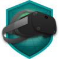

### Hi there 👋

## 🐣 Account

## 💻 Presentation

I am an Unreal developer specialized in Virtual Reality. I obtained a Master's degree in Computer Science specialized in the field of Image, Vision and Interaction in 2020.
- I have experience in the research world
- I worked on an Virtual Reality trainning program within the [Wellputt](https://wellputt.com/) team
- I am currently working on existing projects within [Myxed](https://www.myxed.eu/)
- I like to prototype simple AI when my free time allows it or to do 3D modeling

## ⚡ Technologies

## 🏴󠁧󠁢󠁳󠁣󠁴󠁿 Unreal Badge

### 🥽 Oculus 

### 📘 Blueprints

### 🕰️ Real Time

## :bar_chart: Stats

  
