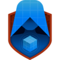

### Hi there 

## 🐣 Account

## 💻 Presentation

I have a Master's degree in Computer Science specialized in the field of Image, Vision and Interaction.
- I have experience in the research world
- I am currently working on an exciting Virtual Reality project within the Wellputt team !
- I like to prototype simple AI when my free time allows it or to do 3D modeling

## ⚡ Technologies

## 🏴󠁧󠁢󠁳󠁣󠁴󠁿 Unreal Badge

### 🥽 Oculus 

### 📘 Blueprints

### 🕰️ Real Time

## :bar_chart: Stats

  
